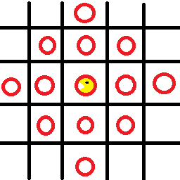

# Porpozycja/pierwszy draft dokumentacji

## Niepewność
  * W zależności od specyfiki języka python implementacja poszczegulnych elementów programu może się różnić i używać analogicznych wersji konceptów programowania np:
    - może nie być takich rzeczy jak enum
    - może nie być takich keyword'ów jak abstract
  * Terminy te są idealistyczne i nie koniecznie muszą działać tak samo pod spodem; liczy się efekt

## Nazewnictwo
  * nie do końca wiem jaki jest standard w pythonie ale proponuję następujące zasady
  * klasy nazywać według konwencji UpperCamelCase
  * zmienne nazywać według konwencji camelCase
  * gdy nazwa zawiera skróty typu FTP to piszemy Ftp z następującego powodu
    - jeśli mieli byśmy obiekt HTTPSFTP to może on oznaczać
      * HTTPS FTP
      * HTTP SFTP
    - HttpsFtp nie pozostawia żadnych wątpliwości
    - poprawia czytelność gdy po skrócie jest kolejne słowo np. AIController co wygląda jak AIC cośtam; AiController nie ma tego problemu
    - te same zasady stosujemy do zmiennych np. httpsFtpController
  * stałe pewnie CONSTANT_CASE

## Klasy
Nazwy klas metod i pól mogą ulec zmianie

### abstract Entity()
  * obiekt znajdujący się w świecie
  * int serialize()
    - metoda zwracająca liczbę przedstawiającą jaki to obiekt i w jakim jest stanie
    - bierze wartości z EntityDictionary żeby było łatwo zmieniać i nie powstały jakieś konflikty
  * jakieś generic metody typu np:
    - destroy(World world) - usuwa Entity z World
  * być może metoda model() która mówi Renderer'owi jak go narysować

### enum EntityDictionary()
  * Zawiera wszystkie kody Entity w różnych stanach np:
    - sciana
    - pacman poruszający się w lewo
    - duch poruszający się dół
  * Kody są liczbami potrzebnymi AI do wejścia sieci neuronowej

### abstract Controller()
  * update(World world)
    - aktualizuje stan aktywnych przycisków na podstawie implementacji np:
      * PlayerController() czyta inputy gracza
      * AiController() na przekazuje stan świata do AI i jego czyta outputy 
      * jakaś inna implementacja może losowo ustawiać wszystko

### abstract Actor(Controller controller) extends Entity()
  * implementacje mogą mieć takie zmienne jak
    - speed - szybkość poruszania Actor'a
  * obiekt mogący aktualizować swoje zachowanie w World
  * update(World world, Time/double/float deltaTime)
    - czyta aktywne przyciski Controller'a
    - sprawdza stan świata (ściany itp.)
    - porusza Actor "płynnie" między polami grida
      * Actor może być w stanie przechodzenia z pola A na pole B
      * World widzi pozycję Actor jako pole A ale widzi też kierunek poruszania
      * w momencie zakończenia przejścia pozycja aktualizuje się na pole B i kierunek może ulec zmianie
      * droga jaką przebywa Actor jest obliczana ze speed i deltaTime 
      * deltaTime pomiędzy aktualizacjami może się różnić a tym samym przebyta droga
      * gdy Actor osiągnie kolejne pole grida nadmiar drogi jest przekazywany do ruchu w kolejnym kierunku jeśli skręca albo dalej na wprost (chyba że wchodzi w ścianę to jest marnowany)
    - na podstawie zasad poruszania aktualizuje swoje zachowanie np:
      * gdy zakończy wchodzenie na skrzyżowanie a kontroler wskazuje kierunek  nie zastawiony ścianą to skręca w tym kierunku
      * gracz może w dowolnym momencie zawrócić do tyłu a duch nie
      * jeśli wchodzimy w ścianę a kontroler wskazuje jej kierunek to nie poruszamy się
    - sprawdza kolizje z innymi obiektami
      * kolizje odbywaję się na podstawie rzeczywistego położenia nie symbolicznego na gridzie
      * grid świata można użyć by sprawdzać kolizję tylko z obiektami na sąsiednich polach (oznaczonych na czerwono); pozycja gracza na gridzie - w samym środku 

### World()
  * świat gry podzielony gridem na pola przechowujący entity
  * grid - tablica czy inna 2d struktura przechowująca jakie Entity znajduje się na danym polu (Point/Apple?, Actor, Wall?)
  * actors - tablica list czy inna struktura przechowująca Actor'ów czyli Entity podlegające aktualizacji
  * update(Time/double/float deltaTime)
    - aktualizuje Actor'ów
    - pewnie coś mądrego jeszcze, jakiś timer czy coś, może wyniki zależy gdzie to damy
  * addActor(Actor actor)
    - Dodaje do listy nowego Actor'a
  * setGrid(Entity entity, Position pos) ???? z braku lepszej nazwy czy coś
    - ustawia jaki Entity jest na danym polu

### Renderer()
  * zarządza oknem a przynajmniej zawratością, rysuje itp
  * render(World world) 
    - Bierze grid World i rysuje Entities na podstawie zerotu z metody model() który zwraca jak go narysować czy coś
      * Entity może mieć różne tekstury na podstawie swojego stanu np:
        - duch normalny/przestraszony
        - pac man obrócony w lewo/prawo
      * Entity może być rysowany równo z gridem albo pomiędzy polami (Actor gdy się porusza)

## Szczegóły aplikacji

### Inicjalizacja
  * tworzymy okno aplikacji
  * inicjalizujemy World, Renderer itp.
  * można ładować layout poziomu z pliku tekstowego
  * jeśli gra działa w trybie symulacji to:
    - nie tworzymy okna gry tylko konsole/brak jakiegokolwiek outputu (bo wolno działa)
    - tworzymy pliki wynikowe (sieć AI)?
    - można nagrywać rozgrywkę i na końcu zapisywać ją jako tekst?

### Pętla główna
  * może być w mainie albo w jakiejś klasie Game
  * wykonuje aktualizacje World a potem rysuje przy pomocy Renderer
  * jeśli gra działa w trybie symulacji to:
    - Renderer jest pomijany bo nie ma interfejsu graficznego
    - można zapisywać historię rozgrywki? ale to może być trudne
    - deltaTime jest stały by symulacja działała jak najszybciej
